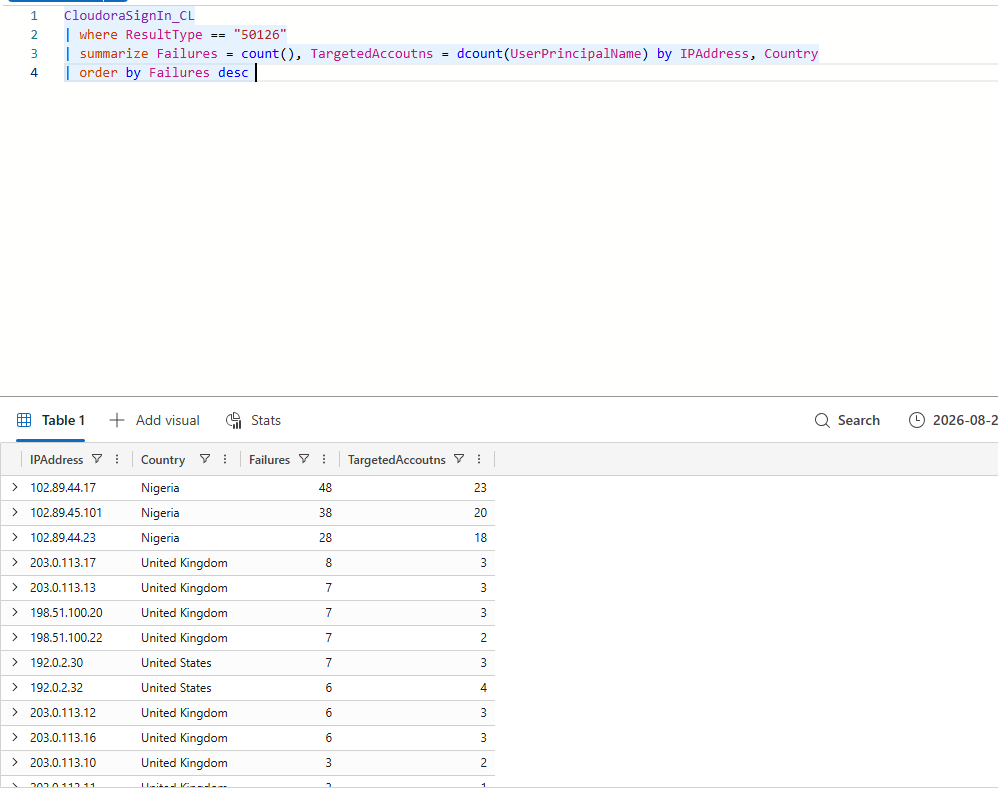
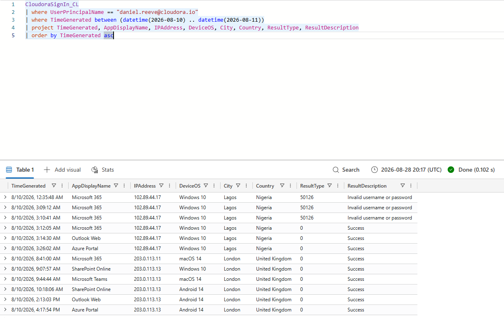
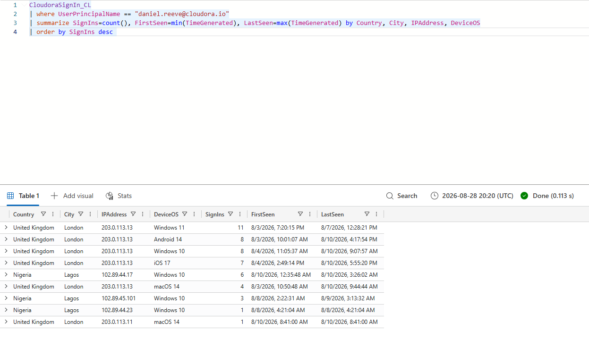
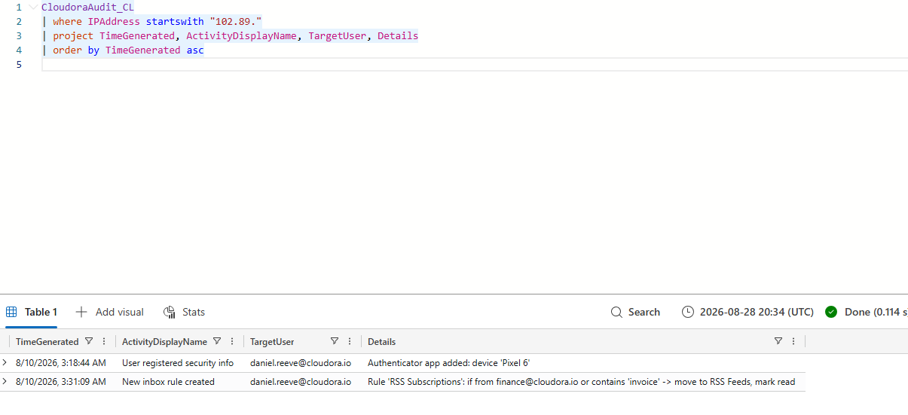
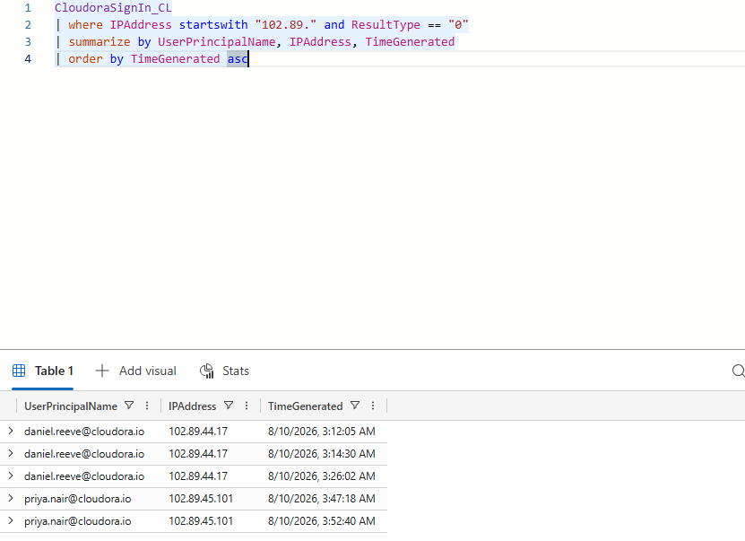
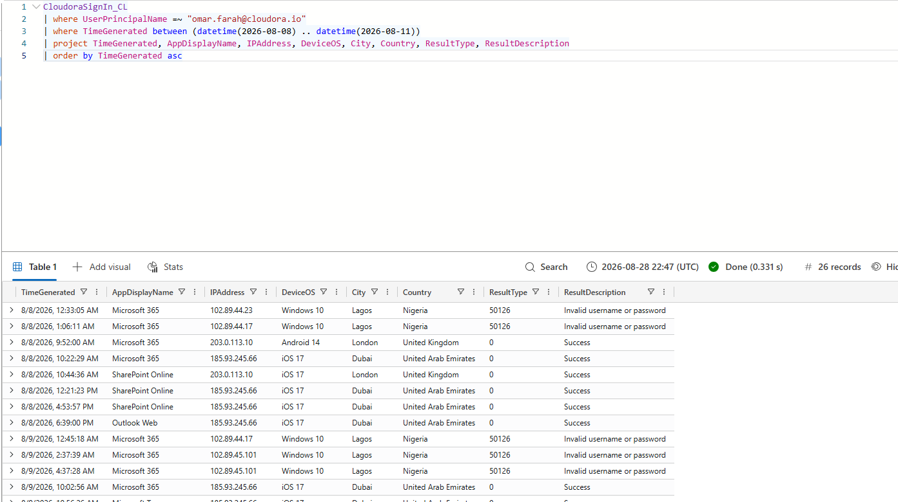
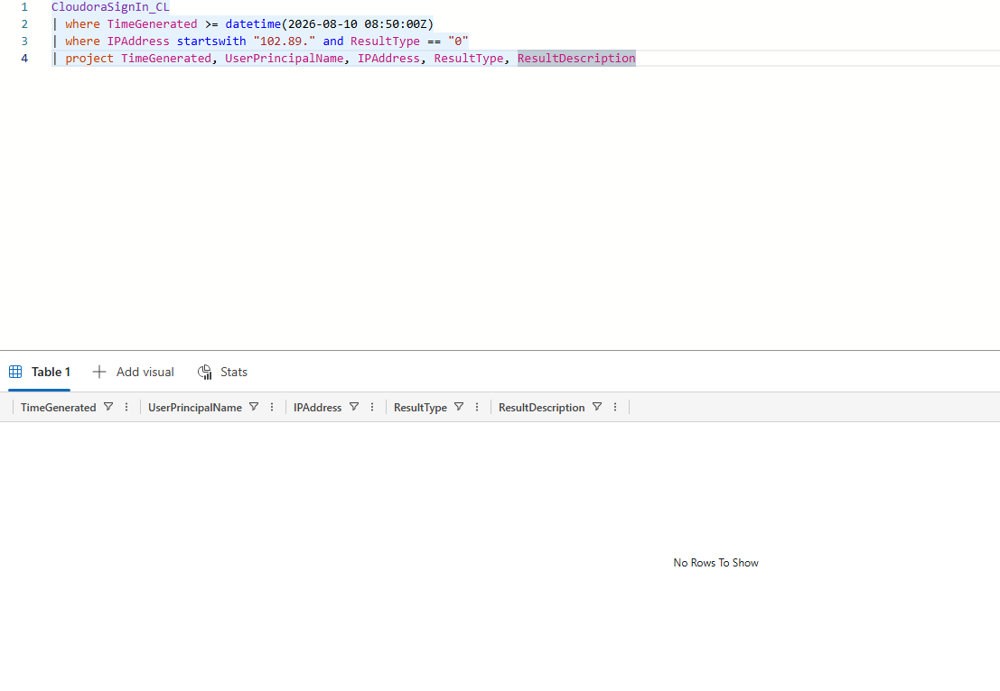

# Cloudora Incident Investigation: Evidence Log

**Related Ticket:** CLD-0001
**Target Setup:** Entra ID / Microsoft 365 / Exchange Online
**Analyst:** Simon Agpoon
**Date (UTC):** August 10, 2026

---

## 1. Password-Spray Detection

I used KQL across `CloudoraSignIn_CL` to find repeated failed login attempts (ResultType 50126) across multiple accounts coming from Lagos, Nigeria. The high number of failed attempts across more than 20 different company accounts confirmed an automated password-spray attack.

**Attack Details:**
- IP Addresses: 102.89.44.17 (48 failures), 102.89.45.101 (38 failures), 102.89.44.23 (28 failures)
- Location: Lagos, Nigeria
- Result Code: 50126 (Invalid username or password)

**Why it matters:** Shows the attacker was guessing passwords across the company before breaking into any specific account.

---

## 2. CEO Account Compromise

I checked Daniel Reeve's sign-in activity and saw multiple failed login attempts from 102.89.44.17 in Lagos, followed right away by a successful login (ResultType 0) at 03:12:05 UTC. Right after logging in, the attacker opened Outlook on the web (03:14:30 UTC) and the Azure Portal (03:26:02 UTC).

**Attack Details:**
- Target Account: daniel.reeve@cloudora.io
- Attacker IP: 102.89.44.17 (Lagos, Nigeria)
- Attacker Device: Windows 10
- First Success: August 10, 2026 at 03:12:05 UTC

**Why it matters:** Proves the attacker got into the CEO's account and gives the exact time the break-in happened.

---

## 3. CEO Account Baseline Comparison

I built a baseline comparison of Daniel Reeve's normal sign-in history against the suspicious login. His normal logins always come from London, United Kingdom, using his usual devices (Mac, iPhone, Windows 11), which showed that the Lagos logins were abnormal.

**Normal vs. Suspicious Activity:**
- Normal Activity: London, UK (203.0.113.13, 203.0.113.11)
- Suspicious Activity: Lagos, Nigeria (102.89.44.17, 102.89.45.101, 102.89.44.23)

**Why it matters:** Comparing normal habits proved this was an impossible trip and confirmed the login was not Daniel working remotely.

---

## 4. Attacker Persistence and Email Hiding Rule

I searched `CloudoraAudit_CL` for changes made by the attacker. The logs showed the attacker added an Authenticator app on a Pixel 6 phone at 03:18:44 UTC and created an inbox rule called "RSS Subscriptions" at 03:31:09 UTC to hide invoice and payment emails.

**Attack Details:**
- Added MFA Device: Pixel 6 / Microsoft Authenticator
- Hidden Mail Rule: RSS Subscriptions (moves emails from finance@cloudora.io and words like "invoice" to RSS Feeds, marks as read)

**Why it matters:** Proves the attacker set up a backup way to stay logged in and hid money emails to set up an email scam.

---

## 5. Scope of Compromised Accounts

I ran a query for all successful logins (ResultType 0) from the attacker's 102.89.x.x address range. The results showed that both Daniel Reeve and Priya Nair had their accounts accessed from these addresses.

**Confirmed Breached Accounts:**
- daniel.reeve@cloudora.io from 102.89.44.17
- priya.nair@cloudora.io from 102.89.45.101

**Why it matters:** Showed the attack affected two accounts, not just one, and revealed that the attacker also accessed SharePoint through Priya's account.

---

## 6. Cleared False Positive: Omar Farah

I investigated the foreign sign-in activity for omar.farah@cloudora.io originating from Dubai, UAE. While his account received spray attempts from Lagos, his Dubai activity showed successful logins from IP 185.93.245.66. All Dubai sign-ins occurred during normal daytime hours (09:00–19:00), succeeded on the first attempt with zero failures from that IP, and used his regular iPhone (iOS 17 / Mobile Safari) matching his London baseline.

**Sign-in Details:**
- Account: omar.farah@cloudora.io
- Location: Dubai, United Arab Emirates (185.93.245.66)
- Device: iPhone (iOS 17 / Mobile Safari)
- Authentication Behavior: 12 logins, all daytime, all succeeded on first attempt (0 failures)
- Outcome: Cleared as legitimate business travel

**Why it matters:** Proved Omar's account was not compromised and prevented unnecessary account lockouts and password resets for a legitimate traveling user.

---

## 7. Post-Containment Verification

After fixing the issue (ending all sessions, removing the fake phone, resetting passwords, deleting the inbox rule, and blocking the bad addresses), I ran a query to confirm no successful logins were occurring from the attacker's network after 08:50:00 UTC.

**Cleanup Checks:**
- Attacker IP Addresses: Blocked
- Open Sessions: All active tokens revoked
- Fake Device and Inbox Rule: Confirmed deleted

**Why it matters:** Confirms the cleanup steps worked and the attacker is completely locked out.
